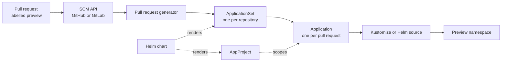

# Architecture

The chart renders Kubernetes objects and nothing else. ArgoCD does the work: the ApplicationSet controller polls the SCM provider, and for each open pull request carrying the configured label it creates an `Application` from the template the chart wrote.

## From pull request to environment



| Stage | Owner | Behaviour |
|-------|-------|-----------|
| Discovery | ApplicationSet controller | Polls the SCM API every `globals.requeueAfterSeconds`, default 500 |
| Filtering | Pull request generator | Keeps requests carrying every configured label, and for GitLab those in `gitlab.pullRequestState` |
| Rendering | ApplicationSet controller | Expands the template once per surviving request |
| Sync | ArgoCD application controller | Applies the rendered source to the destination namespace |
| Removal | ApplicationSet controller | Deletes the `Application` when the request closes or loses the label |

Deletion cascades to the resources the `Application` created, unless `globals.preserveResourcesOnDeletion` is `true`.

## Rendered objects

| Template | Object | Rendered when |
|----------|--------|---------------|
| `github-pr.yml` | `ApplicationSet` per entry in `repos.github` | `repos.github` is populated |
| `gitlab-mr.yml` | `ApplicationSet` per entry in `repos.gitlab` | `repos.gitlab` is populated |
| `projects.yml` | One `AppProject` | `project.enabled` is `true` |

Both provider lists default to empty, so `helm template` against the chart defaults produces no objects. [Testing](testing.md#default-values-render-nothing) covers the CI job that holds that property.

Each `ApplicationSet` is named `<repo>-<provider>-<name>`, with the repository name truncated to 40 characters, and lands in `namespace` with any `.` replaced by `-`.

## Naming

The `Application` name has to be unique across every pull request and, under a multi-cluster fan out, every cluster.

| Provider | Format |
|----------|--------|
| GitHub | `<repo>-{{ .head_short_sha_7 }}-{{ .number }}-<name>` |
| GitLab | `<repo>-{{ .branch_slug }}-{{ .number }}-<name>` |
| Either, with `globals.server: all` | The above, suffixed with `-{{ .nameNormalized }}` |

The cluster suffix is what keeps a matrix fan out from collapsing to a single `Application` per pull request.

## Multi-cluster fan out

`globals.server` holds the destination cluster address, and `all` is a reserved value. It replaces the single pull request generator with a matrix of the [cluster generator](https://argo-cd.readthedocs.io/en/stable/operator-manual/applicationset/Generators-Cluster/) and the pull request generator, so each request is rendered once per cluster registered with ArgoCD. The destination server becomes `{{ .server }}` rather than the fixed address.

```yaml
generators:
- matrix:
    generators:
    - clusters: {}
    - pullRequest:
        github: {}
```

## Source selection

The `Application` source is chosen from the keys present on the repository entry, in this order.

| Keys present | Source | Revision |
|--------------|--------|----------|
| `parameters` | Helm chart from `repoUrl`, with `--set` style parameters | `targetRevision`, default `>= 0` |
| `values` | Helm, from `chart` when set, otherwise from `path` in the repository | `targetRevision`, default `{{ .branch }}` |
| Neither | Kustomize, from `path` | `targetRevision`, default `{{ .branch }}` |

The Kustomize branch is the default. It is the only one that applies `images`, the preview namespace and the common annotations. [Repositories](repositories.md) covers each shape with a worked example.

## Application payload

The two providers share one template, so an `Application` carries the same metadata whichever generator produced it.

| Field | Value |
|-------|-------|
| `labels` | `app.kubernetes.io/name`, `app.kubernetes.io/branch` (branch slug truncated to 63 characters), `app.kubernetes.io/created-by: applicationset` |
| `annotations` | `argocd.argoproj.io/head`, `link.argocd.argoproj.io/external-link`, and everything in `globals.annotations` |
| `syncPolicy.automated` | `prune`, `selfHeal` and `allowEmpty` all enabled |
| `syncPolicy.syncOptions` | `globals.syncOptions` |
| `syncPolicy.retry` | `globals.retry`, passed through unchanged |
| `destination` | `globals.server` and the preview namespace |
| `info` | `author`, `branch`, `target_branch`, `branch_slug`, `head_short_sha`, and `pull_request` or `merge_request` |

The external link is built from the provider API address, so the ArgoCD UI links each preview back to the request that created it. A GitHub API of `https://api.github.com` is rewritten to `https://github.com` for that link; any other value, such as a GitHub Enterprise address, is used as given.

`globals.retry` reaches the `Application` as written. A `limit` of `0` performs no retries, which is the ArgoCD default meaning rather than an unlimited one.

## Preview namespace

The destination namespace is the first value present of the repository's `namespace` and `globals.deployToNamespace`. `CreateNamespace=true` is in the default sync options, so ArgoCD creates it, and the namespace is labelled `app.kubernetes.io/created-by: <repo>` through `managedNamespaceMetadata`.

Every preview for a repository shares that namespace unless a per-repository `namespace` separates them. Two pull requests against the same repository therefore deploy into the same namespace, and any fixed object name inside the manifests collides. Per-branch names in the source, or a namespace holding a `{{ .branch_slug }}` token, keep them apart.

## AppProject

`project.enabled` renders an `AppProject` named after `name`, and switches every generated `Application` from the `default` project onto it. It is off by default, so previews land in `default` until a project is asked for.

`project.destinations` is empty by default, and the destinations are derived instead: `globals.deployToNamespace` plus the `namespace` of every entry in `repos.github` and `repos.gitlab`, deduplicated, each with `server: '*'` and `name: '*'`. Setting `project.destinations` explicitly replaces that derivation.

The remaining project keys are passed through to the `AppProject` spec as written. [Configuration](usage.md#project) lists them with their defaults.
